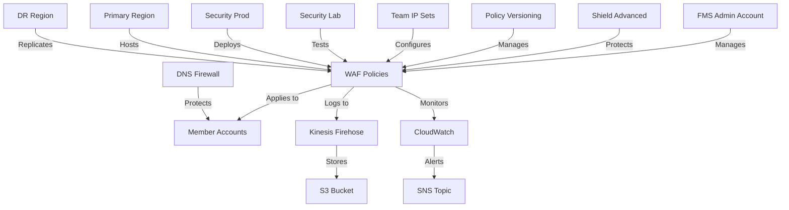

# AWS Firewall Manager (FMS) Infrastructure

This repository contains the infrastructure as code for managing AWS Firewall Manager (FMS) policies across your organization using Terraform.

## Features

- Centralized WAF rule management
- Shield Advanced integration for DDoS protection
- Enhanced logging with Kinesis Firehose
- Policy versioning and staging system
- Automated deployment pipeline
- Comprehensive monitoring and alerting
- Multi-environment support (dev/staging/prod)

## Architecture



## Prerequisites

- AWS Organizations enabled
- AWS Config enabled in member accounts
- FMS administrator account designated
- Terraform >= 1.0
- AWS CLI configured

## Directory Structure

```
.
├── logging/              # Logging configuration
├── monitoring/           # CloudWatch monitoring
├── policies/            # FMS policies
├── security/            # Shield and security configs
├── .github/             # GitHub Actions
└── variables.tf         # Input variables
```

## Quick Start

1. Clone the repository:
   ```bash
   git clone https://github.com/your-org/aws-fms
   ```

2. Initialize Terraform:
   ```bash
   terraform init
   ```

3. Create a terraform.tfvars file:
   ```hcl
   name_prefix = "your-prefix"
   environment = "dev"
   ```

4. Plan and apply:
   ```bash
   terraform plan
   terraform apply
   ```

## Policy Management

### Environments

- **Dev**: All rules in COUNT mode
- **Staging**: Mixed COUNT/BLOCK mode
- **Prod**: All rules in BLOCK mode

### Version Control

Policies are versioned and stored in S3. Each version includes:
- Policy configuration
- Enabled rules
- Override actions
- Timestamp

## Monitoring

### CloudWatch Metrics

- WAF blocked requests
- DDoS attacks detected
- Request rates
- Rule triggers

### Alerts

Alerts are sent to SNS topics for:
- High rate of blocked requests
- DDoS attacks
- Policy changes
- Deployment status

## Logging

Logs are collected via Kinesis Firehose and stored in S3 with:
- Partitioning by date
- Compression
- Lifecycle policies
- Encryption

## Security

- Shield Advanced integration
- DDoS protection
- IP reputation lists
- Rate-based rules
- Custom rule groups

## CI/CD Pipeline

The GitHub Actions pipeline includes:
1. Terraform validation
2. Plan generation
3. Plan review
4. Automated deployment
5. Slack notifications

## Contributing

1. Fork the repository
2. Create a feature branch
3. Commit changes
4. Create a pull request

## License

This project is licensed under the MIT License - see the LICENSE file for details.

## Support

For support, please open an issue in the GitHub repository.