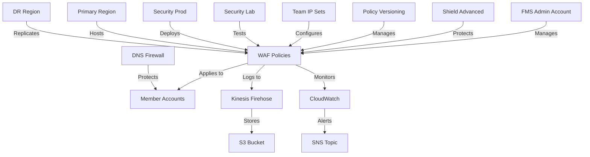

# AWS Firewall Manager (FMS) Infrastructure

This repository contains the infrastructure as code for managing AWS Firewall Manager (FMS) policies across your organization using Terraform.

## TLDR
- **Crowdsourced**: Community-driven repository for AWS Firewall Manager best practices and implementations
- **Centralized Security**: Manages WAF, Shield Advanced, and DNS Firewall policies across multiple AWS accounts
- **Multi-Region**: Supports primary (us-east-1) and DR (us-west-2) regions with consistent security policies
- **Team-Based**: Organizes IP sets and policies by team (Risk, Beacon, Life, EDH) with custom rules
- **Monitoring**: Comprehensive CloudWatch dashboards and alerts for security events
- **Logging**: Automated WAF logging to S3 via Kinesis Firehose with encryption and retention policies
- **Security**: Implements Shield Advanced, DDoS protection, and IP reputation lists
- **CI/CD**: Automated deployment pipeline with GitHub Actions and Slack notifications
- **Versioning**: Policy versioning system with S3 storage and environment-specific configurations

## Features

- Centralized WAF rule management
- Shield Advanced integration for DDoS protection
- Enhanced logging with Kinesis Firehose
- Policy versioning and staging system
- Automated deployment pipeline
- Comprehensive monitoring and alerting
- Multi-environment support (dev/staging/prod)

## Architecture



## Cost Estimation

Below is an estimated monthly cost breakdown for running this infrastructure in a production environment. Costs are approximate and may vary based on usage, region, and specific requirements.

| Service | Description | Monthly Cost (USD) |
|---------|-------------|-------------------|
| **FMS (Firewall Manager)** | Base cost for FMS administration | $100.00 |
| **WAF** | Web Application Firewall rules and requests | $300.00 |
| **Shield Advanced** | DDoS protection per protected resource | $3,000.00 |
| **DNS Firewall** | DNS query filtering and logging | $150.00 |
| **Kinesis Firehose** | Log delivery and processing | $200.00 |
| **S3 Storage** | Log storage and policy versioning | $50.00 |
| **CloudWatch** | Metrics, logs, and alarms | $100.00 |
| **SNS Topics** | Alert notifications | $10.00 |
| **Route53** | DNS resolution and health checks | $50.00 |
| **IAM** | Identity and access management | $0.00 |
| **Total Monthly** | | **$3,960.00** |

## Prerequisites

- AWS Organizations enabled
- AWS Config enabled in member accounts
- FMS administrator account designated
- Terraform >= 1.0
- AWS CLI configured

## Directory Structure

```
.
├── fms-policies/         # FMS policy configurations
│   ├── configurations/   # Configuration files for policies
│   │   ├── dns-firewall/ # DNS Firewall configuration
│   │   ├── security-groups/ # Security group rules
│   │   └── waf-rules/   # WAF rule configurations
│   ├── dns-firewall/     # DNS Firewall module
│   ├── resource-sets/    # Resource set definitions
│   ├── shield/           # Shield Advanced configuration
│   ├── waf/              # WAF policy configuration
│   └── waf-monitoring/   # WAF monitoring setup
├── ip-sets/              # IP set definitions
│   ├── central/          # Centrally managed IP sets
│   └── team-specific/    # Team-specific IP sets
│       ├── risk/         # Risk team IP sets
│       └── app-team-1/   # App team 1 IP sets
├── modules/              # Reusable Terraform modules
│   ├── waf-logging/      # WAF logging configuration
│   ├── waf-monitoring/   # WAF monitoring setup
│   └── waf-rule-groups/  # WAF rule group definitions
├── plan-demo/            # Simplified configuration for planning
├── .github/              # GitHub Actions workflows
├── main.tf               # Main Terraform configuration
├── variables.tf          # Input variables
├── outputs.tf            # Output definitions
├── terraform.tfvars      # Variable values
├── CODEOWNERS            # Code ownership configuration
└── CHANGELOG.md          # Change history
```

## Quick Start

1. Clone the repository:
   ```bash
   git clone https://github.com/your-org/aws-fms
   ```

2. Initialize Terraform:
   ```bash
   terraform init
   ```

3. Create a terraform.tfvars file:
   ```hcl
   name_prefix = "your-prefix"
   environment = "dev"
   ```

4. Plan and apply:
   ```bash
   terraform plan
   terraform apply
   ```

## Planning and Testing

The `plan-demo` directory contains a simplified version of the FMS configuration for planning and testing purposes. This directory includes:

- Basic FMS admin account setup
- Sample WAF policies for each team
- DNS Firewall configuration
- Security Group policies
- Example resources for testing

### Step-by-Step Demo Environment Setup

#### Prerequisites
1. Install required tools:
   ```bash
   # Install AWS CLI
   brew install awscli  # For macOS
   # OR
   curl "https://awscli.amazonaws.com/awscli-exe-linux-x86_64.zip" -o "awscliv2.zip"  # For Linux
   unzip awscliv2.zip
   sudo ./aws/install

   # Install Terraform
   brew install terraform  # For macOS
   # OR
   curl -fsSL https://apt.releases.hashicorp.com/gpg | sudo apt-key add -
   sudo apt-add-repository "deb [arch=amd64] https://apt.releases.hashicorp.com $(lsb_release -cs) main"
   sudo apt-get update && sudo apt-get install terraform  # For Linux
   ```

2. Configure AWS credentials:
   ```bash
   aws configure
   # Enter your:
   # - AWS Access Key ID
   # - AWS Secret Access Key
   # - Default region (e.g., us-east-1)
   # - Default output format (json)
   ```

#### Deployment Steps

1. Clone the repository:
   ```bash
   git clone https://github.com/your-org/aws-fms.git
   cd aws-fms
   ```

2. Create a variables file:
   ```bash
   cd plan-demo
   cat > terraform.tfvars << EOF
   aws_region = "us-east-1"
   environment = "dev"
   fms_admin_account_id = "YOUR_AWS_ACCOUNT_ID"  # Replace with your AWS account ID
   vpc_id = "vpc-xxxxxxxx"  # Replace with your VPC ID
   EOF
   ```

3. Initialize Terraform:
   ```bash
   terraform init
   ```

4. Review the plan:
   ```bash
   terraform plan
   ```

5. Apply the configuration:
   ```bash
   terraform apply
   # Type 'yes' when prompted
   ```

6. Verify the deployment:
   ```bash
   # List FMS policies
   aws fms list-policies

   # List WAF rule groups
   aws wafv2 list-rule-groups --scope REGIONAL

   # Check DNS Firewall rule groups
   aws route53resolver list-firewall-rule-groups
   ```

#### Cleanup

To remove all created resources:
```bash
terraform destroy
# Type 'yes' when prompted
```

#### Troubleshooting

Common issues and solutions:

1. **AWS Credentials Error**
   ```bash
   Error: error getting AWS credentials
   ```
   Solution: Verify AWS credentials are properly configured:
   ```bash
   aws sts get-caller-identity
   ```

2. **Permission Errors**
   ```bash
   Error: AccessDeniedException: User is not authorized to perform fms:PutPolicy
   ```
   Solution: Ensure your AWS user has the necessary FMS permissions:
   - AWSFirewallManagerServiceRole
   - AWSFirewallManagerAdminAccess

3. **VPC Not Found**
   ```bash
   Error: InvalidVpcID.NotFound: The vpc ID 'vpc-xxx' does not exist
   ```
   Solution: Update terraform.tfvars with a valid VPC ID from your account:
   ```bash
   aws ec2 describe-vpcs --query 'Vpcs[*].[VpcId,Tags[?Key==`Name`].Value|[0]]' --output table
   ```

4. **Region Mismatch**
   ```bash
   Error: InvalidParameterException: Invalid region
   ```
   Solution: Ensure the region in terraform.tfvars matches your AWS CLI configuration:
   ```bash
   aws configure get region
   ```

#### Next Steps

After successful deployment:
1. Review the created FMS policies in the AWS Console
2. Test the WAF rules with sample requests
3. Monitor CloudWatch metrics for policy effectiveness
4. Experiment with policy modifications in the plan-demo directory

This simplified configuration helps in:
- Testing policy changes before applying to production
- Understanding the basic FMS setup
- Quick prototyping of new policies
- Training and documentation purposes

## Policy Management

### Environments

- **Dev**: All rules in COUNT mode
- **Staging**: Mixed COUNT/BLOCK mode
- **Prod**: All rules in BLOCK mode

### Version Control

Policies are versioned and stored in S3. Each version includes:
- Policy configuration
- Enabled rules
- Override actions
- Timestamp

## Monitoring

### CloudWatch Metrics

- WAF blocked requests
- DDoS attacks detected
- Request rates
- Rule triggers

### Alerts

Alerts are sent to SNS topics for:
- High rate of blocked requests
- DDoS attacks
- Policy changes
- Deployment status

## Logging

Logs are collected via Kinesis Firehose and stored in S3 with:
- Partitioning by date
- Compression
- Lifecycle policies
- Encryption

## Security

- Shield Advanced integration
- DDoS protection
- IP reputation lists
- Rate-based rules
- Custom rule groups

## CI/CD Pipeline

The GitHub Actions pipeline includes:
1. Terraform validation
2. Plan generation
3. Plan review
4. Automated deployment
5. Slack notifications

## Contributing

1. Fork the repository
2. Create a feature branch
3. Commit changes
4. Create a pull request

## License

This project is licensed under the MIT License - see the LICENSE file for details.

## Support

For support, please open an issue in the GitHub repository.

## DNS Firewall Configuration

The DNS firewall configuration is managed through JSON files in the `fms-policies/configurations/dns-firewall` directory:

- `blocked-domains.json`: List of malicious domains to block
- `allowed-domains.json`: List of trusted domains to allow
- `audit-domains.json`: List of domains to monitor

### Managing Domain Lists

To update domain lists:

1. Edit the appropriate JSON file:
   ```bash
   # Example: Add a domain to block
   vim fms-policies/configurations/dns-firewall/blocked-domains.json
   ```

2. Apply changes:
   ```bash
   terraform plan
   terraform apply
   ```

### DNS Firewall Rules

The configuration creates three types of rules:
1. Block rules for malicious domains
2. Allow rules for trusted domains
3. Audit rules for monitoring suspicious domains

### Example Domain Lists

#### Blocked Domains
```json
{
  "domains": [
    "malicious1.example.com",
    "malicious2.example.com",
    "suspicious1.example.com",
    "suspicious2.example.com"
  ]
}
```

#### Allowed Domains
```json
{
  "domains": [
    "trusted1.example.com",
    "trusted2.example.com"
  ]
}
```

#### Audit Domains
```json
{
  "domains": [
    "monitor1.example.com",
    "monitor2.example.com"
  ]
}
```

## IP Sets Organization

IP sets are organized into two main categories:

### Centrally Managed IP Sets

Located in `ip-sets/central/`, these IP sets are managed by the security team and apply to all resources across the organization. Examples include:

- Internal corporate IP ranges
- Known malicious IP addresses
- Third-party service IP ranges

### Team-Specific IP Sets

Located in `ip-sets/team-specific/`, these IP sets are managed by individual teams and apply only to their resources. Each team has its own directory:

- `risk/`: IP sets for the Risk team
- `app-team-1/`: IP sets for App Team 1
- Additional team directories as needed

### Managing IP Sets

To add or update IP sets:

1. Navigate to the appropriate directory:
   ```bash
   # For centrally managed IP sets
   cd ip-sets/central
   
   # For team-specific IP sets
   cd ip-sets/team-specific/risk
   ```

2. Create or edit the IP set file:
   ```bash
   # Example: Create a new IP set for the Risk team
   touch mendix.tf
   ```

3. Define the IP set:
   ```hcl
   resource "aws_wafv2_ip_set" "mendix" {
     name               = "mendix-ip-set"
     description        = "IP addresses for Mendix application"
     scope              = "REGIONAL"
     ip_address_version = "IPV4"
     addresses          = ["192.168.1.0/24", "10.0.0.0/16"]
     
     tags = {
       Team = "Risk"
       Application = "Mendix"
     }
   }
   ```

4. Apply changes:
   ```bash
   terraform plan
   terraform apply
   ```